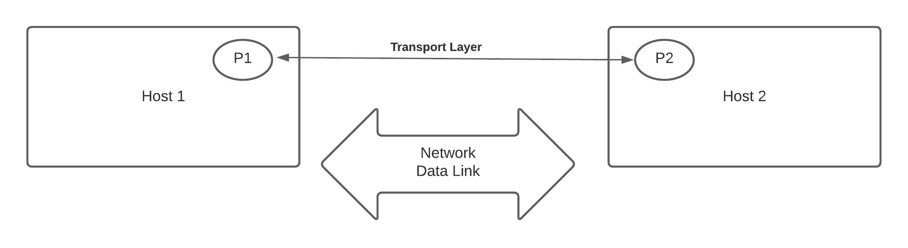
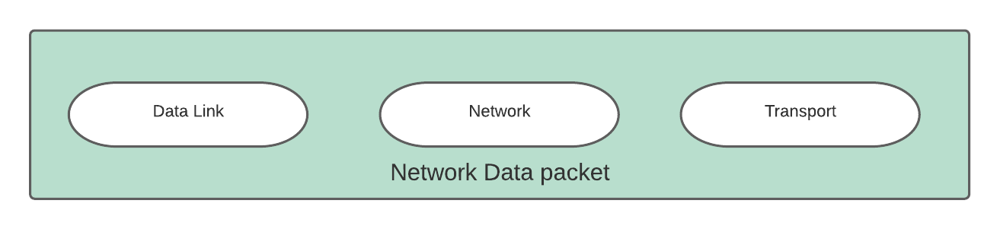
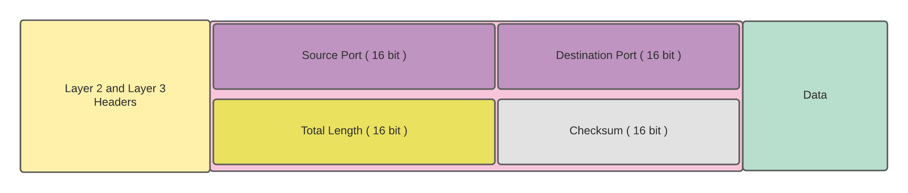
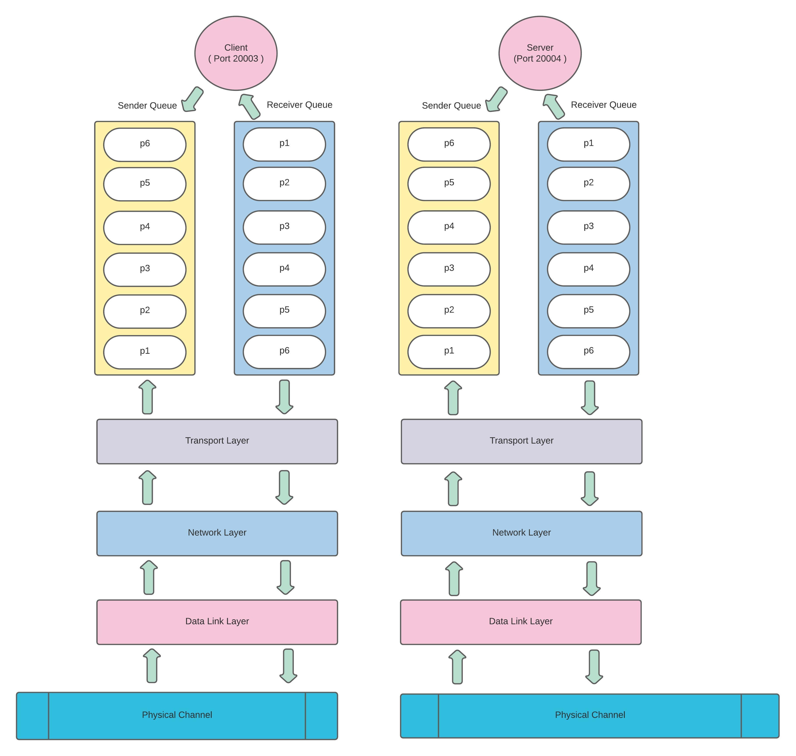

*For more knowledge on Layer 2 and Layer 3 visit my course:*
( https://www.udemy.com/course/network-programming-in-golang-part-1/?referralCode=10D758A5B97503B473DD  )


### OSI Model and Layer 4 ( Transport Layer )

    1. Why ? ( Why this layer is needed )
    2. What ? ( What is it's role and responsibilities )
    3. How ?  ( How it works )

### What we know or should know ?
    * IP address is used to deliver the network data to our machines.
    * Relation between IP address and Physical Address.
    * How OSI Model defines Layer 2 and Layer 3.


### Why we need layer 4 ?
    * To enable process to process communication.

```
Communication on the Internet is not defined as the exchange of data between two nodes or between two hosts. 
Real communication takes place between two processes (application programs).
```

### What is a process ?
    * A running program.

#### How two process communicate to each other
    1. They know each others address.
    2. They know each others message format.
    4. They both have a channel open between them.

#### Example of process to process communication in Golang.

Client.go and server.go


### Transport Layer





##### Client ans Server
    * A method of process to process communication.
    * Client can be a Local Process
    * Server can be a Remote Process


#### Example for Clients or Local Process ( client.go )
   

#### Example for Server or Remote Process ( server.go )
  

#### How Host Identifies a Server or Client Processes 
    * Transport layer implementation

#### Addressing 
    
    

#### How Single Implementation of Transport layer Caters all Process
    * Multiplexing 
    * Demultiplexing

#### Type of Services/Communication at Transport layer
    * Connectionless
    * Connection-Oriented

#### Connectionless ( UDP )
    - Unreliable
    - Connectionless
    - High performance
    - NO error checking

##### UDP Packet



##### Udp Operations
    - Connection less service
    - Flow and Error control
    - Encapsulation and Decapsulation

#### UDP Queuing


#### Next is Golang example for UDP
----------------------------------------------


#### Next - Connection-Oriented ( TCP )

