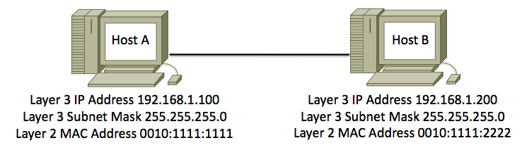
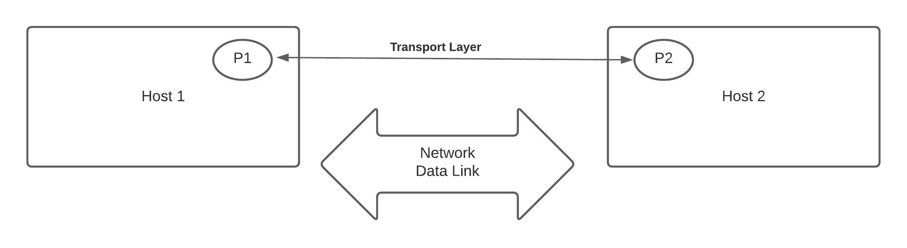
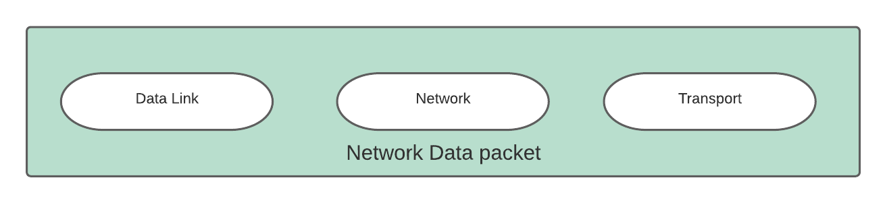
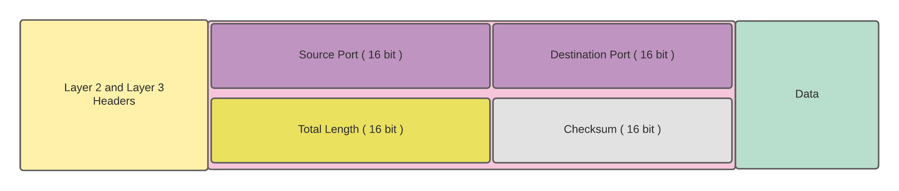
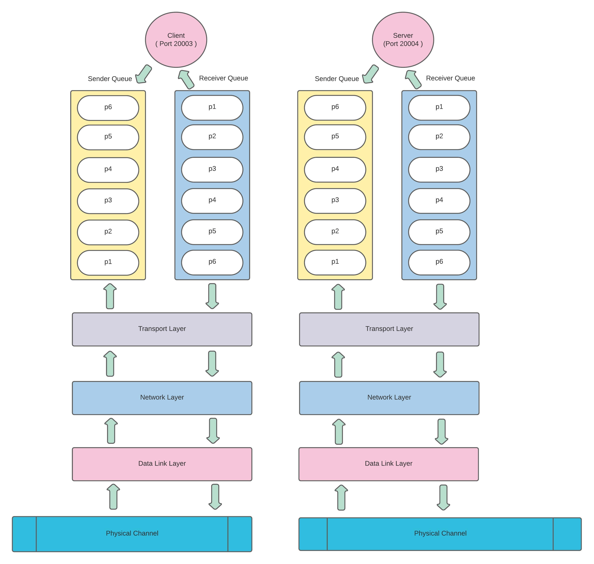

#### Transport Layer
    * The data link layer ------->  Node-to-Node delivery.
    * Network Layer       --------> Host-to-Host delivery.


```
Communication on the Internet is not defined as the exchange of data between two nodes or between two hosts. 
Real communication takes place between two processes (application programs).
```

**Transport layer ---------> Process To Process Delivery**



*For more knowledge on Data Link and Network visit ny course:* 
( https://www.udemy.com/course/network-programming-in-golang-part-1/?referralCode=10D758A5B97503B473DD  )

##### Basic Requirement for Communication
    * Client / Local Process
    * Server / Remote Process
    * Local IP : Local Port
    * Remote IP : Rempte Port

#### Example for Clients or Local Process ( client.go )
   

#### Example for Server or Remote Process ( server.go )
  

#### How Host Identifies a Server or Client Processes 
    * Transport layer implimentation

#### How Single Implementation of Transport layer Caters all Process
    * Multiplexing 
    * Demultiplexing

#### Type of Services/Communication at Transport layer
    * Connectionless
    * Connection-Oriented

#### Connectionless ( UDP )
    - Unreliable
    - Connectionless
    - High performance
    - NO error checking

##### UDP Packet



##### Udp Operations
    - Connection less service
    - Flow and Error control
    - Encapsulation and Decapsulation

#### UDP Queuing


#### Next is Golang example for UDP
----------------------------------------------


#### Next - Connection-Oriented ( TCP )

